# zyy恐怖游戏制作


## 人物移动
### 人物和相机旋转

[FIRST PERSON MOVEMENT in 10 MINUTES - Unity Tutorial - YouTube](https://www.youtube.com/watch?v=f473C43s8nE)


https://docs.unity3d.com/cn/2022.1/ScriptReference/Rigidbody.html


| [interpolation](https://docs.unity3d.com/cn/2022.1/ScriptReference/Rigidbody-interpolation.html) | 插值可以平滑消除固定帧率运行物理导致的现象。 |
| ------------------------------------------------------------ | -------------------------------------------- |
| **[collisionDetectionMode](https://docs.unity3d.com/cn/2022.1/ScriptReference/Rigidbody-collisionDetectionMode.html)** | **刚体的碰撞检测模式。**                     |


collisionDetectionMode

**描述**

刚体的碰撞检测模式。

用于设置刚体以进行连续碰撞检测，可避免快速移动的对象 在未检测到碰撞的情况下穿过其他对象。为获得最佳效果，对于快速移动的对象，请将该值设置为[CollisionDetectionMode.ContinuousDynamic](https://docs.unity3d.com/cn/2022.1/ScriptReference/CollisionDetectionMode.ContinuousDynamic.html)； 

对于需要与之碰撞的其他对象，将该值设置为 [CollisionDetectionMode.Continuous](https://docs.unity3d.com/cn/2022.1/ScriptReference/CollisionDetectionMode.Continuous.html)。 这两个选项对物理性能有很大影响。

或者，您也可以使用 [CollisionDetectionMode.ContinuousSpeculative](https://docs.unity3d.com/cn/2022.1/ScriptReference/CollisionDetectionMode.ContinuousSpeculative.html)， 其通常成本更低，并且也可以用于运动对象。

如果快速对象的碰撞没有任何问题，请保留默认设置， 即 [CollisionDetectionMode.Discrete](https://docs.unity3d.com/cn/2022.1/ScriptReference/CollisionDetectionMode.Discrete.html)。 连

续碰撞检测仅支持带有球体、胶囊体或盒形碰撞体 (BoxColliders) 的刚体。 另请参阅：[CollisionDetectionMode](https://docs.unity3d.com/cn/2022.1/ScriptReference/CollisionDetectionMode.html)。


YPlayerCam

```C#
using System.Collections;
using System.Collections.Generic;
using UnityEngine;

public class YPlayerCam : MonoBehaviour
{
    //灵敏度   
    public float sensX;
    public float sensY;

    //[ orientation方向] 这个放角色
    public Transform orientation;

    float xRotation;
    float yRotation;

    // Start is called before the first frame update
    void Start()
    {
        //锁定鼠标
        //锁定时，光标位于视图的中心且无法移动。其实无论 Cursor.visible 的值如何，光标在此状态下均不可见。
        Cursor.lockState = CursorLockMode.Locked;
        //鼠标不可见
        //Cursor.visible = false;

        sensX = 400;
        sensY = 400;
    }

    // Update is called once per frame
    void Update()
    {
        //获取鼠标输入
        float mouseX = Input.GetAxisRaw("Mouse X") * Time.deltaTime * sensX;
        float mouseY = Input.GetAxisRaw("Mouse Y") * Time.deltaTime * sensY;
        yRotation += mouseX;
        xRotation -= mouseY;

        xRotation = Mathf.Clamp(xRotation,-90f,90f);

        //旋转相机
        transform.rotation = Quaternion.Euler(xRotation,yRotation,0);
        //同时旋转角色
        orientation.transform.rotation = Quaternion.Euler(xRotation,yRotation,0);
    }
}

```


正的时候往下转

```C#
        //鼠标左右动，相机绕着y轴转
        yRotation += mouseX;
        //鼠标上下动，相机绕着x轴转
        xRotation -= mouseY;
```


unity是左手坐标系 对于所有轴来说 正方向都是顺时针


YMoveCamera

```C#
using System.Collections;
using System.Collections.Generic;
using UnityEngine;

public class YMoveCamera : MonoBehaviour
{
    //此代码功能：让相机位置永远位于角色眼睛部分

    public Transform cameraPos;

    // Update is called once per frame
    void Update()
    {
        transform.position = cameraPos.position;
    }
}

```


### 人物移动


如果仅仅是以下这样 人物会像在冰上滑行一样

```C#
using System.Collections;
using System.Collections.Generic;
using UnityEngine;

public class YPlayerMovement : MonoBehaviour
{
    [Header("Movement")]
    public float moveSpeed;
    Rigidbody rb;
    float horizontalInput;
    float verticalInput;
    public Transform orientation;
    Vector3 moveDiretion;
    // Start is called before the first frame update
    void Start()
    {
        rb = GetComponent<Rigidbody>();
        rb.freezeRotation = true;
    }
    void Update()
    {
        myInput();
    }
    void myInput()
    {
        horizontalInput = Input.GetAxisRaw("Horizontal");
        verticalInput = Input.GetAxisRaw("Vertical");
    }
    private void FixedUpdate()
    {
        MovePlayer();
    }
    private void MovePlayer()
    {
        //计算移动方向
        moveDiretion = orientation.forward * verticalInput + orientation.right * horizontalInput;
        rb.AddForce(moveDiretion.normalized * moveSpeed * 10f, ForceMode.Force);
    }
}

```


whatIsGround


```C#
using System.Collections;
using System.Collections.Generic;
using UnityEngine;

public class YPlayerMovement : MonoBehaviour
{
    [Header("Movement")]
    public float moveSpeed;

    public float groundDrag;

    //防止滑动太平滑，检查是否是地面 是的话就把他拉回来 不让他继续滑
    [Header("GroundCheck")]
    public float playerHeight;
    public LayerMask whatIsGround;
    bool grounded;

    Rigidbody rb;
    float horizontalInput;
    float verticalInput;
    public Transform orientation;
    Vector3 moveDiretion;
    // Start is called before the first frame update
    void Start()
    {
        rb = GetComponent<Rigidbody>();
        rb.freezeRotation = true;
        groundDrag = 5f;
        playerHeight = 2f;
        //whatIsGround = LayerMask.NameToLayer("WhatIsGround");
        //Debug.Log(LayerMask.NameToLayer("WhatIsGround"));
    }
    void Update()
    {
        grounded = Physics.Raycast(transform.position,Vector3.down,playerHeight*0.5f+0.2f,whatIsGround);
        myInput();
        SpeedControl();

        if (grounded)
            rb.drag = groundDrag;
        else
            rb.drag = 0;
    }
    void myInput()
    {
        horizontalInput = Input.GetAxisRaw("Horizontal");
        verticalInput = Input.GetAxisRaw("Vertical");
    }
    private void FixedUpdate()
    {
        MovePlayer();
    }
    private void MovePlayer()
    {
        //计算移动方向
        moveDiretion = orientation.forward * verticalInput + orientation.right * horizontalInput;
        rb.AddForce(moveDiretion.normalized * moveSpeed * 10f, ForceMode.Force);
    }
    private void SpeedControl()
    {
        Vector3 flatVel = new Vector3(rb.velocity.x, 0f, rb.velocity.y);
        //限制移动速度
        if(flatVel.magnitude>moveSpeed)
        {
            Vector3 limitedVel = flatVel.normalized * moveSpeed;
            rb.velocity = new Vector3(limitedVel.x,rb.velocity.y,limitedVel.z);
        }
    }
}

```


### 跳跃


```C#
using System.Collections;
using System.Collections.Generic;
using UnityEngine;

public class YPlayerMovement : MonoBehaviour
{
    [Header("Movement")]
    public float moveSpeed;

    public float groundDrag;

    [Header("Keybinds")]
    public KeyCode jumpKey = KeyCode.Space;
    public float jumpForce;
    public float jumpCooldown;
    public float airMultiplier;
    bool readyToJump;


    //防止滑动太平滑，检查是否是地面 是的话就把他拉回来 不让他继续滑
    [Header("GroundCheck")]
    public float playerHeight;
    public LayerMask whatIsGround;
    bool grounded;


    Rigidbody rb;
    float horizontalInput;
    float verticalInput;
    public Transform orientation;
    Vector3 moveDiretion;
    // Start is called before the first frame update
    void Start()
    {
        readyToJump = true;
        rb = GetComponent<Rigidbody>();
        rb.freezeRotation = true;
        groundDrag = 5f;
        playerHeight = 2f;
        //whatIsGround = LayerMask.NameToLayer("WhatIsGround");
        //Debug.Log(LayerMask.NameToLayer("WhatIsGround"));
    }
    void Update()
    {
        grounded = Physics.Raycast(transform.position,Vector3.down,playerHeight*0.5f+0.2f,whatIsGround);
        myInput();
        SpeedControl();

        if (grounded)
            rb.drag = groundDrag;
        else
            rb.drag = 0;
    }
    void myInput()
    {
        horizontalInput = Input.GetAxisRaw("Horizontal");
        verticalInput = Input.GetAxisRaw("Vertical");

        //什么时候跳
        if(Input.GetKey(jumpKey)&&readyToJump&&grounded)
        {
            readyToJump = false;
            Jump();
            Invoke(nameof(resetJump),jumpCooldown);
        }
    }
    private void FixedUpdate()
    {
        MovePlayer();
    }
    private void MovePlayer()
    {
        //计算移动方向
        moveDiretion = orientation.forward * verticalInput + orientation.right * horizontalInput;
        if(grounded)
            rb.AddForce(moveDiretion.normalized * moveSpeed * 10f, ForceMode.Force);
        if (!grounded)
            rb.AddForce(moveDiretion.normalized*moveSpeed*10f*airMultiplier,ForceMode.Force);
    }
    private void SpeedControl()
    {
        Vector3 flatVel = new Vector3(rb.velocity.x, 0f, rb.velocity.z);
        //限制移动速度
        if(flatVel.magnitude>moveSpeed)
        {
            Vector3 limitedVel = flatVel.normalized * moveSpeed;
            rb.velocity = new Vector3(limitedVel.x,rb.velocity.y,limitedVel.z);
        }
    }
    public void Jump()
    {
        //重置y轴 这样每次才能跳一样高 !!!
        rb.velocity = new Vector3(rb.velocity.x,0f,rb.velocity.z);

        rb.AddForce(transform.up * jumpForce, ForceMode.Impulse);
    }
    public void resetJump()
    {
        readyToJump = true;
    }
}

```


##### 一些配置


## 状态机 敌人AI巡逻追赶

鬼追赶

https://www.youtube.com/@davegamedevelopment/videos?view=0&sort=dd&shelf_id=0

https://www.jianshu.com/p/1d75b09b4a37


https://www.youtube.com/watch?v=YdERlPfwUb0


##### 关于lambda表达式

lambda表达式，表示一个匿名函数，=>前面的是参数，后面的是函数体。
你可以把它当作一个函数。

举例：
Func<int, int, int> Add = (x, y) => x + y;
Console.WriteLine(Add(2, 3)); // 5


##### ？ 问号表达式


```cs
a?.PropertyOfA

string bar = (a == null ? null : a.PropertyOfA);
```


> If you want even more information C# has a System defined Struct called Nullable<T>
>
> https://msdn.microsoft.com/en-us/library/b3h38hb0.aspx
>
> Code (CSharp):
>
> 1. **float**? highAngle;
>
> is just shorthand for
>
> Code (CSharp):
>
> 1. Nullable<**float**> highAngle = [new](http://www.google.com/search?q=new+msdn.microsoft.com) Nullable<**float**>();
>
> In general in C# anything that is a reference type variable (like classes) are nullable inherently and can't use the ? syntax
>
> Value type variables (floats, int, structs) can't be null so you need to use ? to make them able to equal a null. (this is different than equaling 0).
>
> 一般来说，在c#中，任何引用类型变量(如类)本质上都是可空的，不能使用?语法
>
> **值类型**变量(浮动，int, structs)不能为空，所以你需要**使用?使它们能够等于null**。(这和等于0不同)


##### readonly

在[字段声明](https://learn.microsoft.com/zh-cn/dotnet/csharp/language-reference/keywords/readonly#readonly-field-example)中，`readonly` 指示只能在声明期间或在同一个类的**构造函数中向字段赋值**。 可以在字段声明和构造函数中多次分配和重新分配只读字段。

**构造函数退出后，不能分配 `readonly` 字段**。

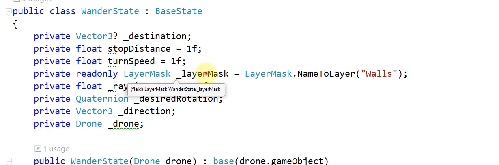


##### 射线检测


#####  transform.forward VS vector3.forward

https://answers.unity.com/questions/1311757/difference-between-transformforward-and-vector3for.html

`Vector3.forward` is the unit vector defined by **(0, 0, 1)**

`transform.forward` is the forward direction of the object in the world space. 物体面向的


##### Physics.SphereCast

当球体扫描与任何碰撞器相交时为true，否则为false。

https://docs.unity3d.com/ScriptReference/Physics.SphereCast.html

public static bool **SphereCast**([Vector3](https://docs.unity3d.com/ScriptReference/Vector3.html) **origin**, float **radius**, [Vector3](https://docs.unity3d.com/ScriptReference/Vector3.html) **direction**, out [RaycastHit](https://docs.unity3d.com/ScriptReference/RaycastHit.html) **hitInfo**, float **maxDistance** = Mathf.Infinity, int **layerMask** = DefaultRaycastLayers, [QueryTriggerInteraction](https://docs.unity3d.com/ScriptReference/QueryTriggerInteraction.html) **queryTriggerInteraction** = QueryTriggerInteraction.UseGlobal);

沿光线投射一个球体，并返回击中物体的详细信息。

当Raycast没有提供足够的精度时，这是很有用的，因为你想知道一个特定大小的对象，比如一个角色，是否能够在不与任何东西碰撞的情况下移动到某个地方。把球体想象成一层厚厚的光线。在这种情况下，射线由起始矢量和方向指定。


#### Quaternion相关 欧拉角相关

[Unity - Scripting API: Quaternion (unity3d.com)](https://docs.unity3d.com/ScriptReference/Quaternion.html)


##### **Quaternion.LookRotation**

public static [Quaternion](https://docs.unity3d.com/ScriptReference/Quaternion.html) **LookRotation**([Vector3](https://docs.unity3d.com/ScriptReference/Vector3.html) **forward**, [Vector3](https://docs.unity3d.com/ScriptReference/Vector3.html) **upwards** = Vector3.up);

以指定的向前和向上方向创建一个旋转

https://docs.unity3d.com/ScriptReference/Quaternion.LookRotation.html


#####  **[Quaternion](https://docs.unity3d.com/cn/2021.1/ScriptReference/Quaternion.html).Slerp**

public static [Quaternion](https://docs.unity3d.com/cn/2021.1/ScriptReference/Quaternion.html) **Slerp** ([Quaternion](https://docs.unity3d.com/cn/2021.1/ScriptReference/Quaternion.html) **a**, [Quaternion](https://docs.unity3d.com/cn/2021.1/ScriptReference/Quaternion.html) **b**, float **t**);

 参数

| a    | 起始值，当 t = 0 时返回。 |
| ---- | ------------------------- |
| b    | 结束值，当 t = 1 时返回。 |
| t    | 插值比率。                |

返回

**Quaternion** 在四元数 a 和 b 之间进行球形插值的四元数。

 描述

在四元数 `a` 与 `b` 之间按比率 `t` 进行球形插值。参数 `t` 限制在范围 [0, 1] 内。

这可用于创建一个旋转，以基于参数的值 `a`，在第一个四元数 `a` 到第二个四元数 `b` 之间平滑进行插值。如果参数的值接近于 0，则输出会接近于 /a/，如果参数的值接近于 1，则输出会接近于 /b/。


#####  **欧拉角与vector3互转**

https://blog.csdn.net/m0_37763682/article/details/107461513

```C#
//四元数转化成欧拉角    eulerAngles为Quaternion类的一个Get方法 均可直接调用
Vector3 p = transform.rotation.eulerAngles;

//欧拉角转换成四元数     
Quaternion rotation = Quaternion.Euler(p)
```


##### 项目相关源码

这里我们完成

[物体移动时，面朝移动方向旋转_CXW30的博客-CSDN博客_移动方向的前方怎么表述](https://blog.csdn.net/qq_32605447/article/details/90693227)、

[Unity Vector3与Quaternion相互转换_Parkergh的博客-CSDN博客_quaternion转vector3](https://blog.csdn.net/m0_37763682/article/details/107461513)

```C#
 private void MovePlayer()
    {
        //计算移动方向
        moveDiretion = orientation.forward * verticalInput + orientation.right * horizontalInput;
        if(grounded)
            rb.AddForce(moveDiretion.normalized * moveSpeed * 10f, ForceMode.Force);
        if (!grounded)
            rb.AddForce(moveDiretion.normalized*moveSpeed*10f*airMultiplier,ForceMode.Force);
        
        //使主角要移动时，面向要旋转的方向，且必须避免镜头看天空或者地面时，角色也跟着转动
        //[物体移动时，面朝移动方向旋转_CXW30的博客-CSDN博客_移动方向的前方怎么表述](https://blog.csdn.net/qq_32605447/article/details/90693227)
        //[Unity Vector3与Quaternion相互转换_Parkergh的博客-CSDN博客_quaternion转vector3](https://blog.csdn.net/m0_37763682/article/details/107461513)
        Quaternion lookRot = Quaternion.LookRotation(moveDiretion);    //dir为前方节点的pos
        Vector3 lookR = lookRot.eulerAngles;
        //也就是说 角色只能绕着y轴转动
        lookR = new Vector3(0f,lookR.y,0f);
        lookRot = Quaternion.Euler(lookR);

        transform.rotation = Quaternion.Slerp(transform.rotation, lookRot, Mathf.Clamp01(rotSpeed * Time.deltaTime));

    }
```


#### event Action<>

https://cloud.tencent.com/developer/article/1710289

```C#
public event Action<YBaseState> OnStateChanged;
...
OnStateChanged?.Invoke(CurrentState);
```


#### 参考来源


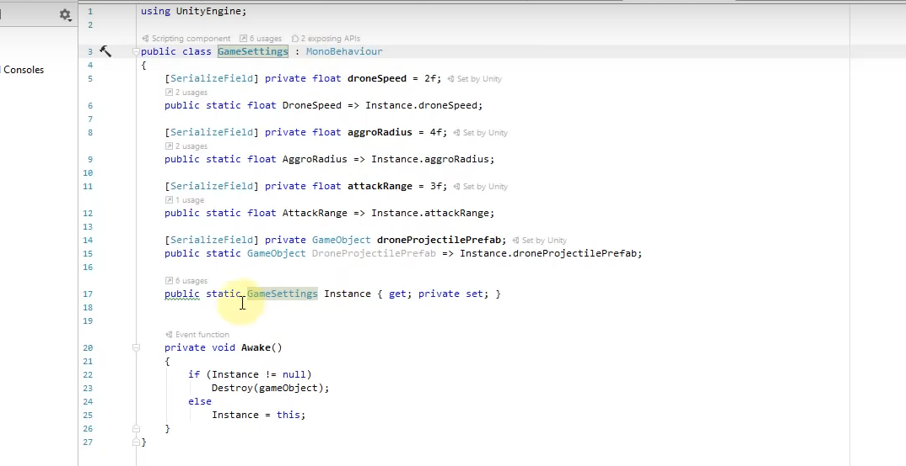


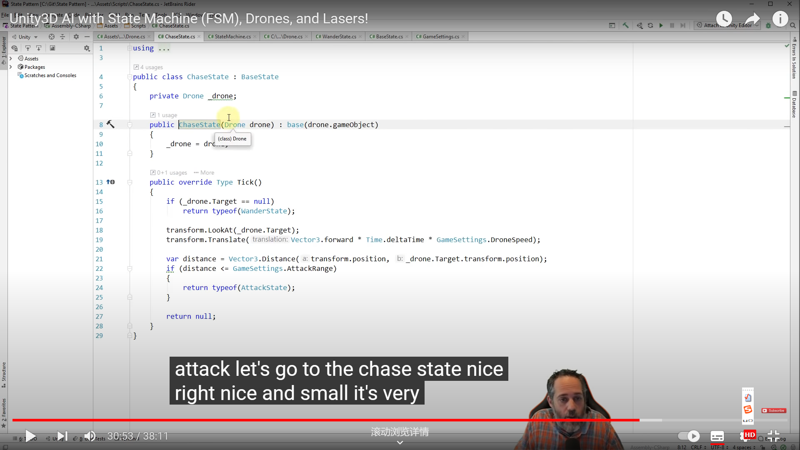


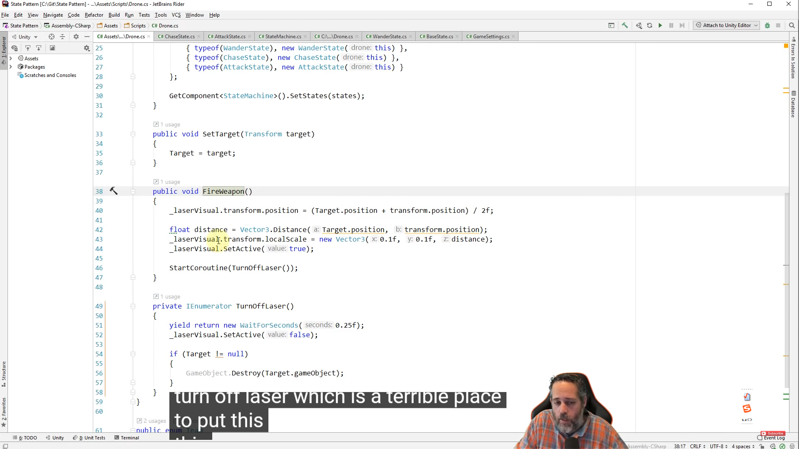

wander

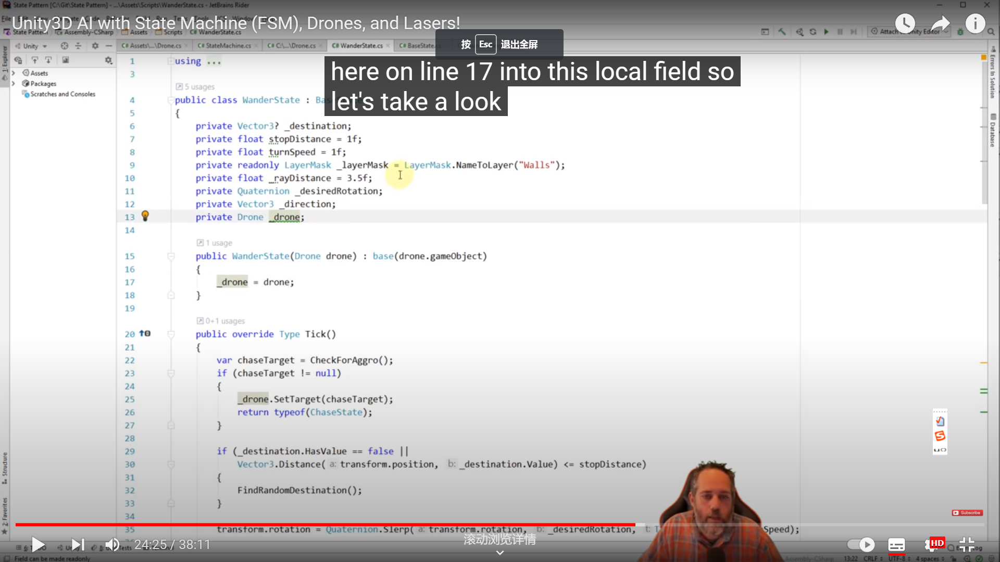

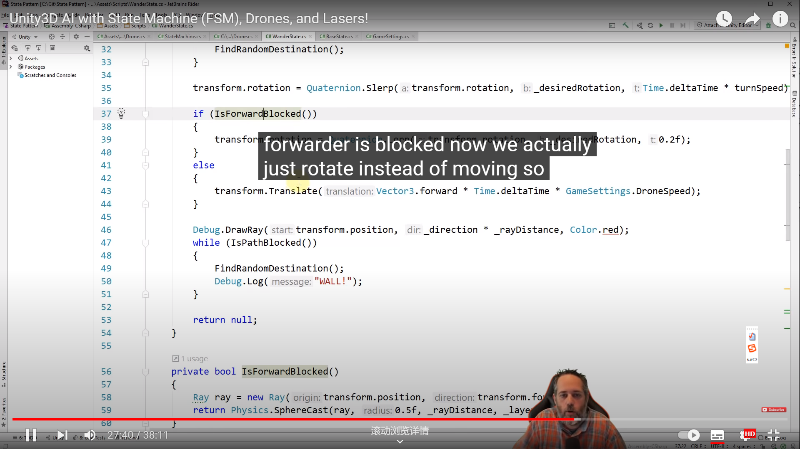

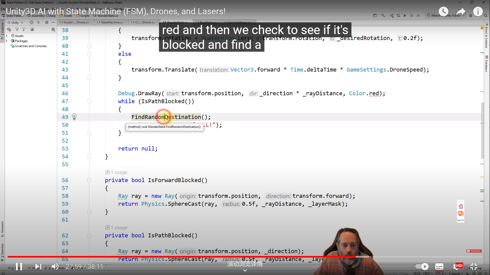

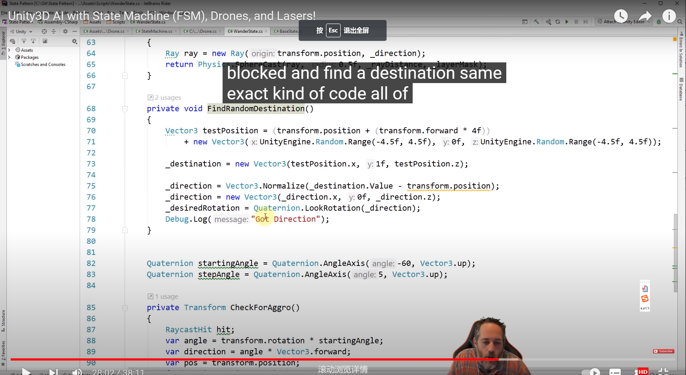

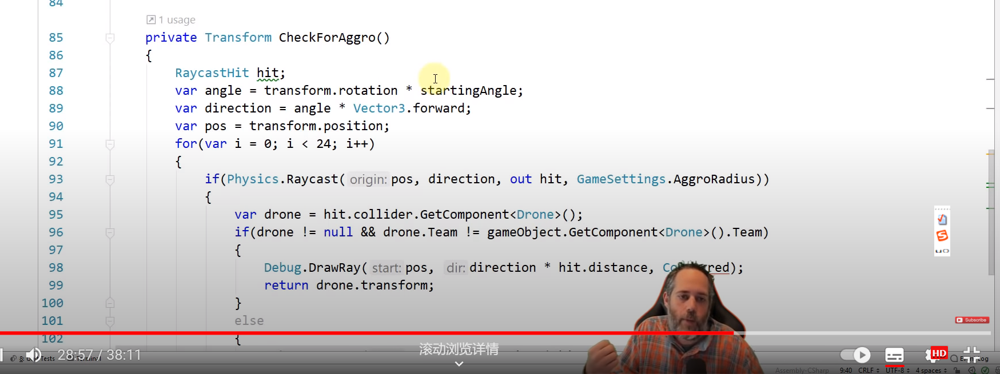


attack

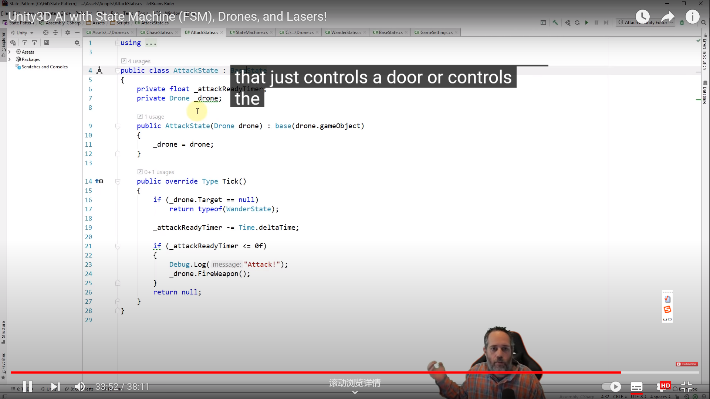


statemachine

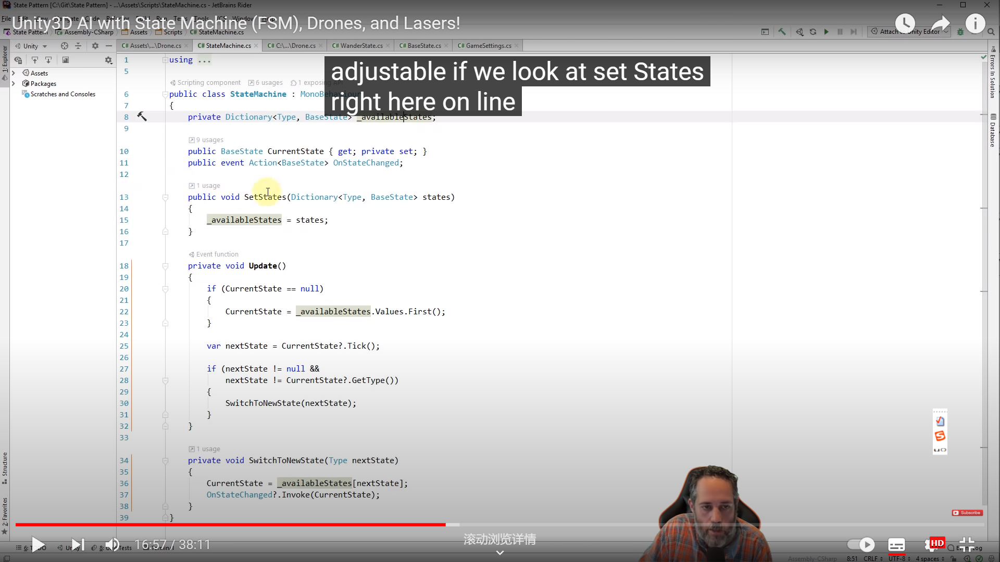


```C#
 Quaternion startingAngle = Quaternion.AngleAxis(-60, Vector3.up);
    Quaternion stepAngle = Quaternion.AngleAxis(5, Vector3.up);
    
    private Transform CheckForAggro()
    {
        float aggroRadius = 5f;
        
        RaycastHit hit;
        var angle = transform.rotation * startingAngle;
        var direction = angle * Vector3.forward;
        var pos = transform.position;
        for(var i = 0; i < 24; i++)
        {
            if(Physics.Raycast(pos, direction, out hit, aggroRadius))
            {
                var drone = hit.collider.GetComponent<Drone>();
                if(drone != null && drone.Team != gameObject.GetComponent<Drone>().Team)
                {
                    Debug.DrawRay(pos, direction * hit.distance, Color.red);
                    return drone.transform;
                }
                else
                {
                    Debug.DrawRay(pos, direction * hit.distance, Color.yellow);
                }
            }
            else
            {
                Debug.DrawRay(pos, direction * aggroRadius, Color.white);
            }
            direction = stepAngle * direction;
        }

        return null;
    }
}

```


#### 单例模式

https://developer.aliyun.com/article/239654


调用单例模式的方法:

```C#
            YUIManager litjson = YUIManager.getInstance() as YUIManager;
            litjson.flashScreen();
```


### navMes寻路

https://youtu.be/atCOd4o7tG4

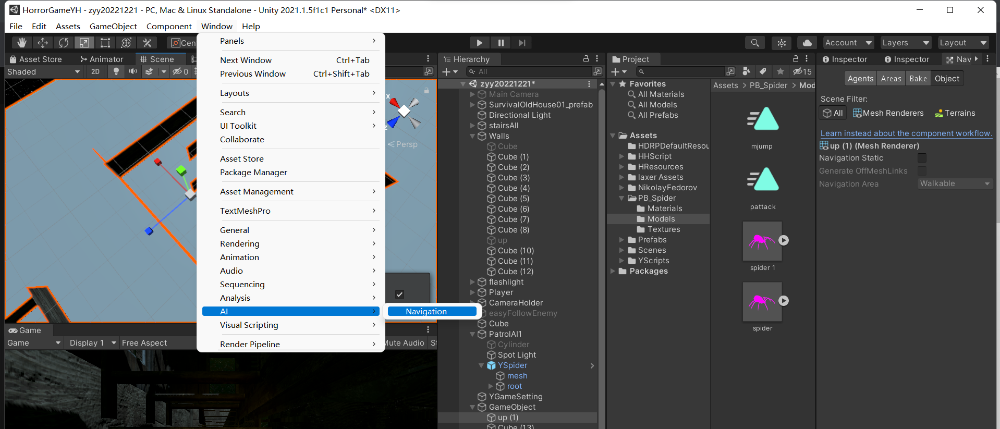


##### 地板

给我们的地板添加一个：

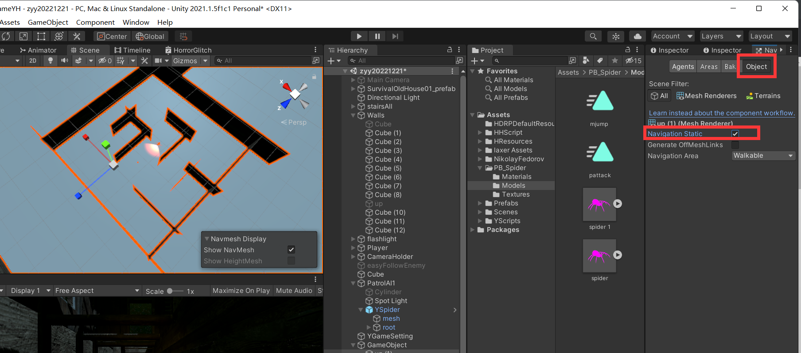

这个表明他是不会移动的

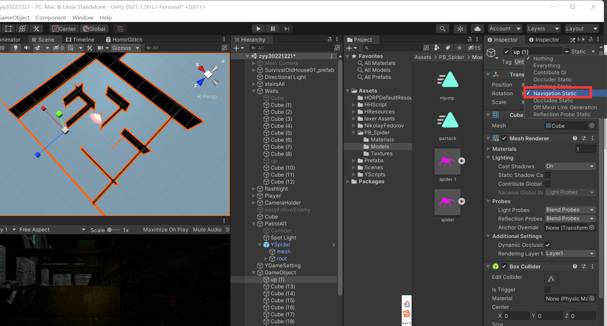


然后bake

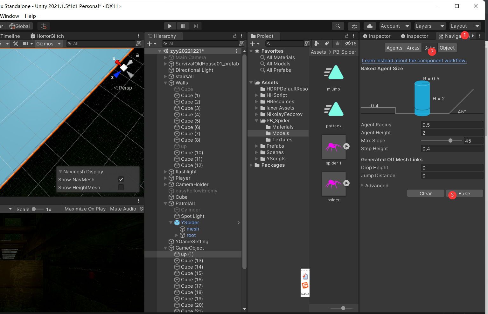


##### 路障

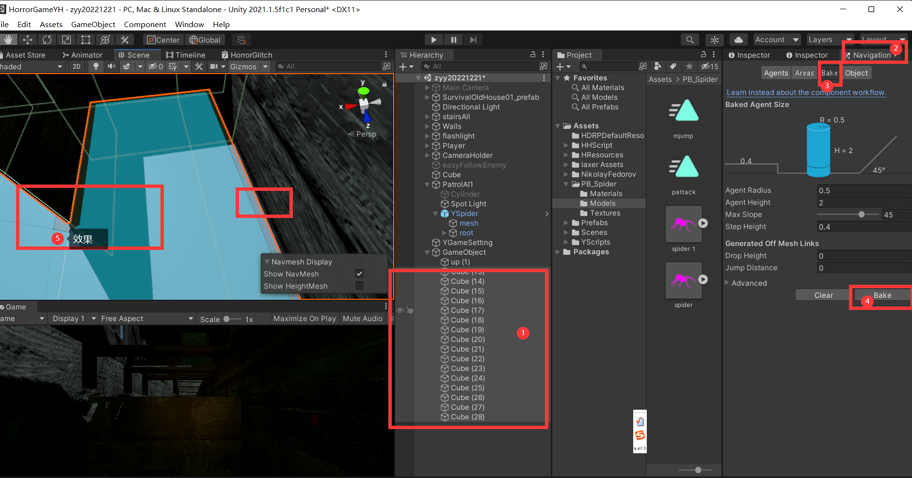


##### 寻路者

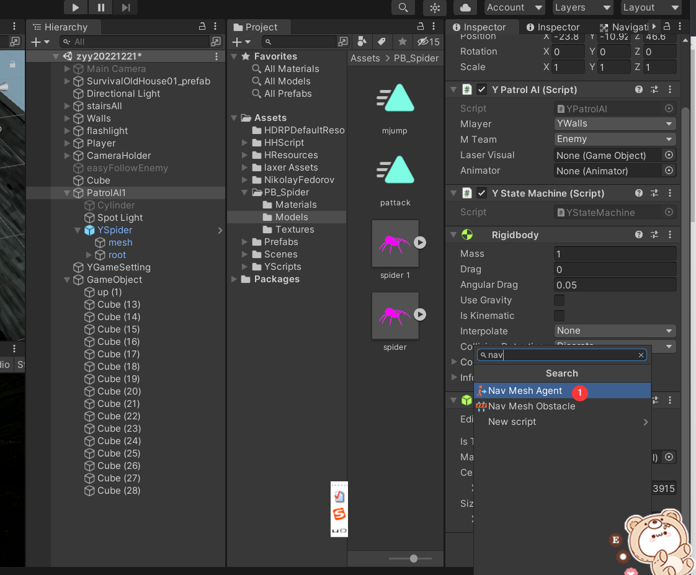

```C#
 patrolAI.mNavMeshAgent.destination = patrolAI.mTarget.position;
```

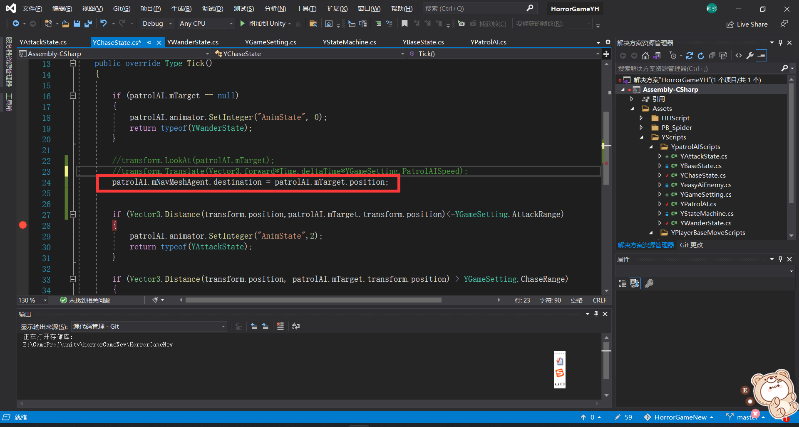


## 屏幕效果相关

下面两个效果都放在manager中


#### 屏幕流血效果

```C#
using System.Collections;
using System.Collections.Generic;
using UnityEngine;
using UnityEngine.UI;

public class YUIManager : MonoBehaviour
{
    public Image pBloodImage;
    public static Image BloodImage => Instance.pBloodImage;

    public Color defaultColor;
    public Color flashColor;
    public float flashTimer=2f;
    public float flashTimerTemp=2f;
    public bool beginFlash;
    public float flashStep;
    public bool bShakeCamera;
    //public float magnitude = 10000f;

    private Vector3 v3Shake = new Vector3(-0.5f,0.6f,0f);
    public Vector3 defaultv3 = new Vector3(0,0,0);
    public Camera shakeCamera;
    public static YUIManager Instance { get; private set; }
    private void Awake()
    {
        if (Instance)
        {
            Destroy(gameObject);
        }
        else
        {
            Instance = this;
        }
    }

    public void Start()
    {
        defaultColor = BloodImage.color;
    }

    public static object getInstance()
    {
        return Instance;
    }

    public void flashScreen()
    {
        beginFlash = true;
        //StartCoroutine(flash());
    }
    public void shakeScreen()
    {
        bShakeCamera = true;
    }
    private void Update()
    {
        if(beginFlash)
        {
            Debug.Log(shakeCamera.transform.position.x);
            flashTimerTemp -= Time.deltaTime * flashStep;
            if(flashTimerTemp > 1)
            {
                BloodImage.color =
                Color.Lerp(flashColor, defaultColor, flashTimerTemp);

                if(bShakeCamera)
                shakeCamera.transform.localPosition
                    = Vector3.Lerp(defaultv3, v3Shake, flashTimerTemp);
            }
            else if (flashTimerTemp <=1&& flashTimerTemp > 0)
            {
                BloodImage.color =
                Color.Lerp(defaultColor, flashColor, flashTimerTemp);

                if (bShakeCamera)
                    shakeCamera.transform.localPosition
                   = Vector3.Lerp(v3Shake, defaultv3, flashTimerTemp);
            }
            else if (flashTimerTemp <= 0) 
            {
                Debug.Log("flashOver");
                beginFlash = false;
                flashTimerTemp = flashTimer;
                BloodImage.color = defaultColor;

                shakeCamera.transform.localPosition = defaultv3;
            }
        }

    }


}

```


#### 屏幕震动

这里采用的方法是直接震动相机

和上面那个一样的原理 放在上面了

我们使用 **localPosition** 设置相对位置，直接用position的话。用的是绝对位置，会出错，要小心。


## 动画相关

#### Unity Animator 切换动作时物体的位置发生变化

https://blog.csdn.net/weixin_41767230/article/details/109356322


重新back一下animation就可以了 （造成问题可能是因为它是基于上一个动画的动作？我也不太懂

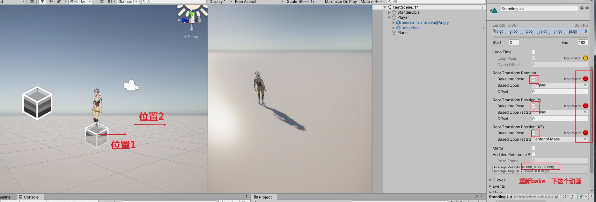

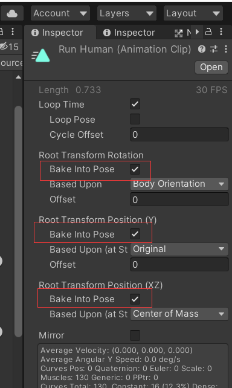

## 想继续加的

看到之后改变灯的颜色