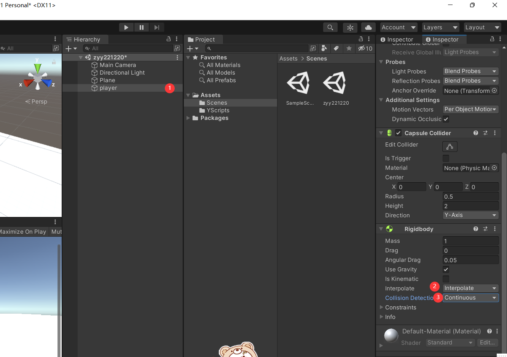
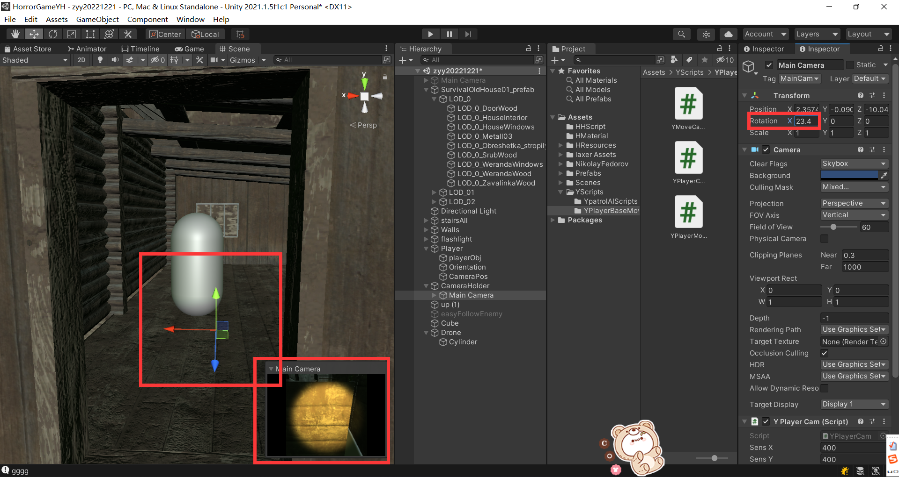
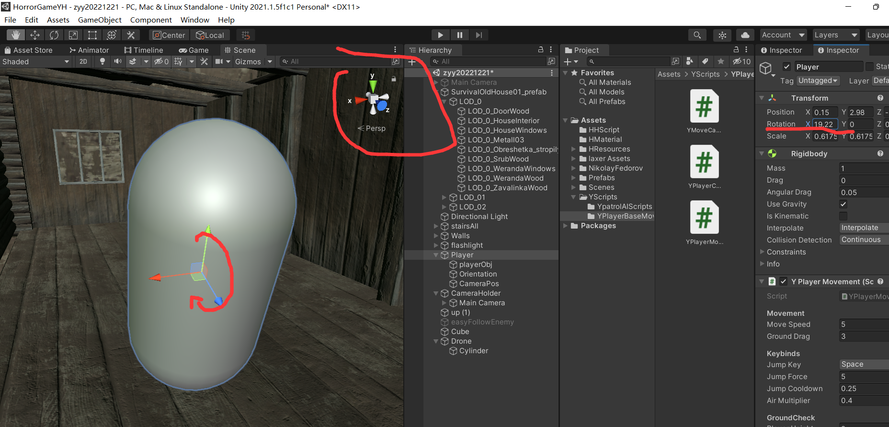
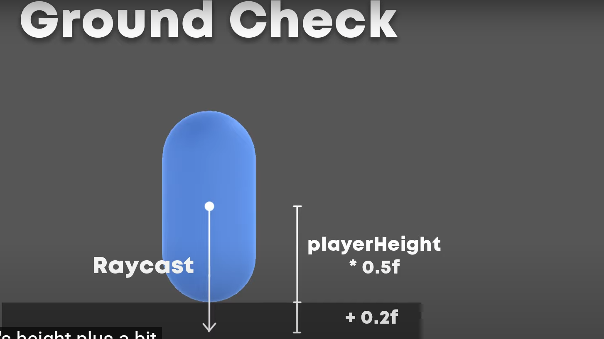
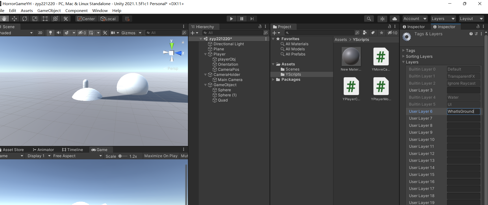
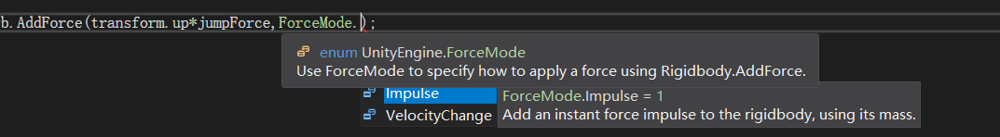
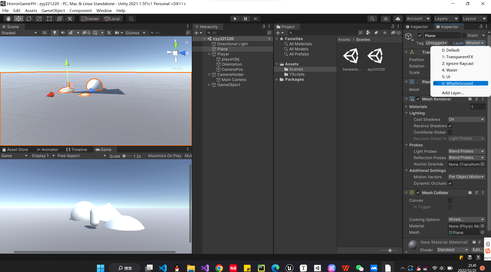
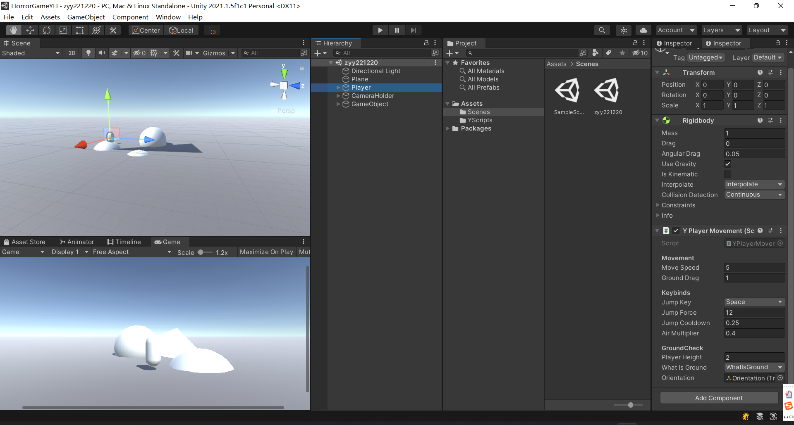
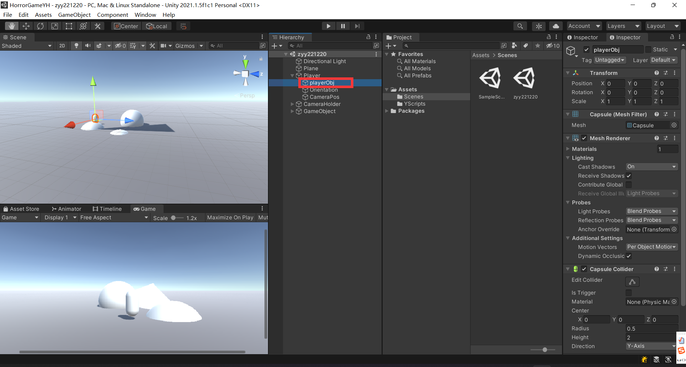
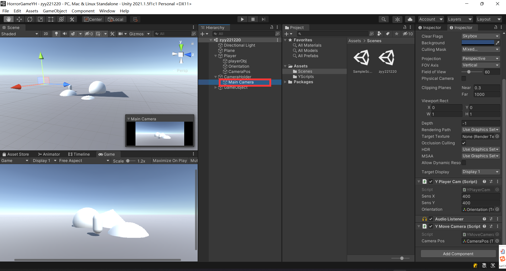

# zyy恐怖游戏制作


## 人物移动
### 人物和相机旋转

[FIRST PERSON MOVEMENT in 10 MINUTES - Unity Tutorial - YouTube](https://www.youtube.com/watch?v=f473C43s8nE)


https://docs.unity3d.com/cn/2022.1/ScriptReference/Rigidbody.html



| [interpolation](https://docs.unity3d.com/cn/2022.1/ScriptReference/Rigidbody-interpolation.html) | 插值可以平滑消除固定帧率运行物理导致的现象。 |
| ------------------------------------------------------------ | -------------------------------------------- |
| **[collisionDetectionMode](https://docs.unity3d.com/cn/2022.1/ScriptReference/Rigidbody-collisionDetectionMode.html)** | **刚体的碰撞检测模式。**                     |


collisionDetectionMode

**描述**

刚体的碰撞检测模式。

用于设置刚体以进行连续碰撞检测，可避免快速移动的对象 在未检测到碰撞的情况下穿过其他对象。为获得最佳效果，对于快速移动的对象，请将该值设置为[CollisionDetectionMode.ContinuousDynamic](https://docs.unity3d.com/cn/2022.1/ScriptReference/CollisionDetectionMode.ContinuousDynamic.html)； 

对于需要与之碰撞的其他对象，将该值设置为 [CollisionDetectionMode.Continuous](https://docs.unity3d.com/cn/2022.1/ScriptReference/CollisionDetectionMode.Continuous.html)。 这两个选项对物理性能有很大影响。

或者，您也可以使用 [CollisionDetectionMode.ContinuousSpeculative](https://docs.unity3d.com/cn/2022.1/ScriptReference/CollisionDetectionMode.ContinuousSpeculative.html)， 其通常成本更低，并且也可以用于运动对象。

如果快速对象的碰撞没有任何问题，请保留默认设置， 即 [CollisionDetectionMode.Discrete](https://docs.unity3d.com/cn/2022.1/ScriptReference/CollisionDetectionMode.Discrete.html)。 连

续碰撞检测仅支持带有球体、胶囊体或盒形碰撞体 (BoxColliders) 的刚体。 另请参阅：[CollisionDetectionMode](https://docs.unity3d.com/cn/2022.1/ScriptReference/CollisionDetectionMode.html)。


YPlayerCam

```C#
using System.Collections;
using System.Collections.Generic;
using UnityEngine;

public class YPlayerCam : MonoBehaviour
{
    //灵敏度   
    public float sensX;
    public float sensY;

    //[ orientation方向] 这个放角色
    public Transform orientation;

    float xRotation;
    float yRotation;

    // Start is called before the first frame update
    void Start()
    {
        //锁定鼠标
        //锁定时，光标位于视图的中心且无法移动。其实无论 Cursor.visible 的值如何，光标在此状态下均不可见。
        Cursor.lockState = CursorLockMode.Locked;
        //鼠标不可见
        //Cursor.visible = false;

        sensX = 400;
        sensY = 400;
    }

    // Update is called once per frame
    void Update()
    {
        //获取鼠标输入
        float mouseX = Input.GetAxisRaw("Mouse X") * Time.deltaTime * sensX;
        float mouseY = Input.GetAxisRaw("Mouse Y") * Time.deltaTime * sensY;
        yRotation += mouseX;
        xRotation -= mouseY;

        xRotation = Mathf.Clamp(xRotation,-90f,90f);

        //旋转相机
        transform.rotation = Quaternion.Euler(xRotation,yRotation,0);
        //同时旋转角色
        orientation.transform.rotation = Quaternion.Euler(xRotation,yRotation,0);
    }
}

```



正的时候往下转

```C#
        //鼠标左右动，相机绕着y轴转
        yRotation += mouseX;
        //鼠标上下动，相机绕着x轴转
        xRotation -= mouseY;
```


unity是左手坐标系 对于所有轴来说 正方向都是顺时针




YMoveCamera

```C#
using System.Collections;
using System.Collections.Generic;
using UnityEngine;

public class YMoveCamera : MonoBehaviour
{
    //此代码功能：让相机位置永远位于角色眼睛部分

    public Transform cameraPos;

    // Update is called once per frame
    void Update()
    {
        transform.position = cameraPos.position;
    }
}

```


### 人物移动


如果仅仅是以下这样 人物会像在冰上滑行一样

```C#
using System.Collections;
using System.Collections.Generic;
using UnityEngine;

public class YPlayerMovement : MonoBehaviour
{
    [Header("Movement")]
    public float moveSpeed;
    Rigidbody rb;
    float horizontalInput;
    float verticalInput;
    public Transform orientation;
    Vector3 moveDiretion;
    // Start is called before the first frame update
    void Start()
    {
        rb = GetComponent<Rigidbody>();
        rb.freezeRotation = true;
    }
    void Update()
    {
        myInput();
    }
    void myInput()
    {
        horizontalInput = Input.GetAxisRaw("Horizontal");
        verticalInput = Input.GetAxisRaw("Vertical");
    }
    private void FixedUpdate()
    {
        MovePlayer();
    }
    private void MovePlayer()
    {
        //计算移动方向
        moveDiretion = orientation.forward * verticalInput + orientation.right * horizontalInput;
        rb.AddForce(moveDiretion.normalized * moveSpeed * 10f, ForceMode.Force);
    }
}

```





whatIsGround




```C#
using System.Collections;
using System.Collections.Generic;
using UnityEngine;

public class YPlayerMovement : MonoBehaviour
{
    [Header("Movement")]
    public float moveSpeed;

    public float groundDrag;

    //防止滑动太平滑，检查是否是地面 是的话就把他拉回来 不让他继续滑
    [Header("GroundCheck")]
    public float playerHeight;
    public LayerMask whatIsGround;
    bool grounded;

    Rigidbody rb;
    float horizontalInput;
    float verticalInput;
    public Transform orientation;
    Vector3 moveDiretion;
    // Start is called before the first frame update
    void Start()
    {
        rb = GetComponent<Rigidbody>();
        rb.freezeRotation = true;
        groundDrag = 5f;
        playerHeight = 2f;
        //whatIsGround = LayerMask.NameToLayer("WhatIsGround");
        //Debug.Log(LayerMask.NameToLayer("WhatIsGround"));
    }
    void Update()
    {
        grounded = Physics.Raycast(transform.position,Vector3.down,playerHeight*0.5f+0.2f,whatIsGround);
        myInput();
        SpeedControl();

        if (grounded)
            rb.drag = groundDrag;
        else
            rb.drag = 0;
    }
    void myInput()
    {
        horizontalInput = Input.GetAxisRaw("Horizontal");
        verticalInput = Input.GetAxisRaw("Vertical");
    }
    private void FixedUpdate()
    {
        MovePlayer();
    }
    private void MovePlayer()
    {
        //计算移动方向
        moveDiretion = orientation.forward * verticalInput + orientation.right * horizontalInput;
        rb.AddForce(moveDiretion.normalized * moveSpeed * 10f, ForceMode.Force);
    }
    private void SpeedControl()
    {
        Vector3 flatVel = new Vector3(rb.velocity.x, 0f, rb.velocity.y);
        //限制移动速度
        if(flatVel.magnitude>moveSpeed)
        {
            Vector3 limitedVel = flatVel.normalized * moveSpeed;
            rb.velocity = new Vector3(limitedVel.x,rb.velocity.y,limitedVel.z);
        }
    }
}

```


### 跳跃




```C#
using System.Collections;
using System.Collections.Generic;
using UnityEngine;

public class YPlayerMovement : MonoBehaviour
{
    [Header("Movement")]
    public float moveSpeed;

    public float groundDrag;

    [Header("Keybinds")]
    public KeyCode jumpKey = KeyCode.Space;
    public float jumpForce;
    public float jumpCooldown;
    public float airMultiplier;
    bool readyToJump;


    //防止滑动太平滑，检查是否是地面 是的话就把他拉回来 不让他继续滑
    [Header("GroundCheck")]
    public float playerHeight;
    public LayerMask whatIsGround;
    bool grounded;


    Rigidbody rb;
    float horizontalInput;
    float verticalInput;
    public Transform orientation;
    Vector3 moveDiretion;
    // Start is called before the first frame update
    void Start()
    {
        readyToJump = true;
        rb = GetComponent<Rigidbody>();
        rb.freezeRotation = true;
        groundDrag = 5f;
        playerHeight = 2f;
        //whatIsGround = LayerMask.NameToLayer("WhatIsGround");
        //Debug.Log(LayerMask.NameToLayer("WhatIsGround"));
    }
    void Update()
    {
        grounded = Physics.Raycast(transform.position,Vector3.down,playerHeight*0.5f+0.2f,whatIsGround);
        myInput();
        SpeedControl();

        if (grounded)
            rb.drag = groundDrag;
        else
            rb.drag = 0;
    }
    void myInput()
    {
        horizontalInput = Input.GetAxisRaw("Horizontal");
        verticalInput = Input.GetAxisRaw("Vertical");

        //什么时候跳
        if(Input.GetKey(jumpKey)&&readyToJump&&grounded)
        {
            readyToJump = false;
            Jump();
            Invoke(nameof(resetJump),jumpCooldown);
        }
    }
    private void FixedUpdate()
    {
        MovePlayer();
    }
    private void MovePlayer()
    {
        //计算移动方向
        moveDiretion = orientation.forward * verticalInput + orientation.right * horizontalInput;
        if(grounded)
            rb.AddForce(moveDiretion.normalized * moveSpeed * 10f, ForceMode.Force);
        if (!grounded)
            rb.AddForce(moveDiretion.normalized*moveSpeed*10f*airMultiplier,ForceMode.Force);
    }
    private void SpeedControl()
    {
        Vector3 flatVel = new Vector3(rb.velocity.x, 0f, rb.velocity.z);
        //限制移动速度
        if(flatVel.magnitude>moveSpeed)
        {
            Vector3 limitedVel = flatVel.normalized * moveSpeed;
            rb.velocity = new Vector3(limitedVel.x,rb.velocity.y,limitedVel.z);
        }
    }
    public void Jump()
    {
        //重置y轴 这样每次才能跳一样高 !!!
        rb.velocity = new Vector3(rb.velocity.x,0f,rb.velocity.z);

        rb.AddForce(transform.up * jumpForce, ForceMode.Impulse);
    }
    public void resetJump()
    {
        readyToJump = true;
    }
}

```


##### 一些配置










## 可以实现的

鬼追赶

https://www.youtube.com/@davegamedevelopment/videos?view=0&sort=dd&shelf_id=0

https://www.jianshu.com/p/1d75b09b4a37


https://www.youtube.com/watch?v=YdERlPfwUb0


##### 关于lambda表达式

lambda表达式，表示一个匿名函数，=>前面的是参数，后面的是函数体。
你可以把它当作一个函数。

举例：
Func<int, int, int> Add = (x, y) => x + y;
Console.WriteLine(Add(2, 3)); // 5


##### ？


```cs
a?.PropertyOfA

string bar = (a == null ? null : a.PropertyOfA);
```


> If you want even more information C# has a System defined Struct called Nullable<T>
>
> https://msdn.microsoft.com/en-us/library/b3h38hb0.aspx
>
> Code (CSharp):
>
> 1. **float**? highAngle;
>
> is just shorthand for
>
> Code (CSharp):
>
> 1. Nullable<**float**> highAngle = [new](http://www.google.com/search?q=new+msdn.microsoft.com) Nullable<**float**>();
>
> In general in C# anything that is a reference type variable (like classes) are nullable inherently and can't use the ? syntax
>
> Value type variables (floats, int, structs) can't be null so you need to use ? to make them able to equal a null. (this is different than equaling 0).
>
> 一般来说，在c#中，任何引用类型变量(如类)本质上都是可空的，不能使用?语法
>
> **值类型**变量(浮动，int, structs)不能为空，所以你需要**使用?使它们能够等于null**。(这和等于0不同)


