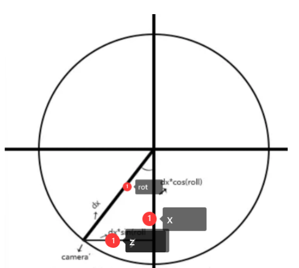
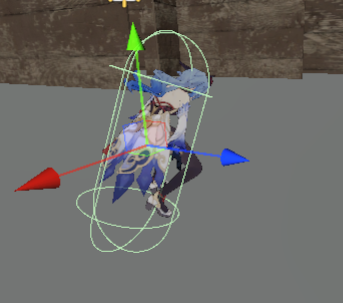

# zyy恐怖游戏制作


## 人物移动
### 人物和相机旋转

[FIRST PERSON MOVEMENT in 10 MINUTES - Unity Tutorial - YouTube](https://www.youtube.com/watch?v=f473C43s8nE)


https://docs.unity3d.com/cn/2022.1/ScriptReference/Rigidbody.html


| [interpolation](https://docs.unity3d.com/cn/2022.1/ScriptReference/Rigidbody-interpolation.html) | 插值可以平滑消除固定帧率运行物理导致的现象。 |
| ------------------------------------------------------------ | -------------------------------------------- |
| **[collisionDetectionMode](https://docs.unity3d.com/cn/2022.1/ScriptReference/Rigidbody-collisionDetectionMode.html)** | **刚体的碰撞检测模式。**                     |


collisionDetectionMode

**描述**

刚体的碰撞检测模式。

用于设置刚体以进行连续碰撞检测，可避免快速移动的对象 在未检测到碰撞的情况下穿过其他对象。为获得最佳效果，对于快速移动的对象，请将该值设置为[CollisionDetectionMode.ContinuousDynamic](https://docs.unity3d.com/cn/2022.1/ScriptReference/CollisionDetectionMode.ContinuousDynamic.html)； 

对于需要与之碰撞的其他对象，将该值设置为 [CollisionDetectionMode.Continuous](https://docs.unity3d.com/cn/2022.1/ScriptReference/CollisionDetectionMode.Continuous.html)。 这两个选项对物理性能有很大影响。

或者，您也可以使用 [CollisionDetectionMode.ContinuousSpeculative](https://docs.unity3d.com/cn/2022.1/ScriptReference/CollisionDetectionMode.ContinuousSpeculative.html)， 其通常成本更低，并且也可以用于运动对象。

如果快速对象的碰撞没有任何问题，请保留默认设置， 即 [CollisionDetectionMode.Discrete](https://docs.unity3d.com/cn/2022.1/ScriptReference/CollisionDetectionMode.Discrete.html)。 连

续碰撞检测仅支持带有球体、胶囊体或盒形碰撞体 (BoxColliders) 的刚体。 另请参阅：[CollisionDetectionMode](https://docs.unity3d.com/cn/2022.1/ScriptReference/CollisionDetectionMode.html)。


YPlayerCam

```C#
using System.Collections;
using System.Collections.Generic;
using UnityEngine;

public class YPlayerCam : MonoBehaviour
{
    //灵敏度   
    public float sensX;
    public float sensY;

    //[ orientation方向] 这个放角色
    public Transform orientation;

    float xRotation;
    float yRotation;

    // Start is called before the first frame update
    void Start()
    {
        //锁定鼠标
        //锁定时，光标位于视图的中心且无法移动。其实无论 Cursor.visible 的值如何，光标在此状态下均不可见。
        Cursor.lockState = CursorLockMode.Locked;
        //鼠标不可见
        //Cursor.visible = false;

        sensX = 400;
        sensY = 400;
    }

    // Update is called once per frame
    void Update()
    {
        //获取鼠标输入
        float mouseX = Input.GetAxisRaw("Mouse X") * Time.deltaTime * sensX;
        float mouseY = Input.GetAxisRaw("Mouse Y") * Time.deltaTime * sensY;
        yRotation += mouseX;
        xRotation -= mouseY;

        xRotation = Mathf.Clamp(xRotation,-90f,90f);

        //旋转相机
        transform.rotation = Quaternion.Euler(xRotation,yRotation,0);
        //同时旋转角色
        orientation.transform.rotation = Quaternion.Euler(xRotation,yRotation,0);
    }
}

```


正的时候往下转

```C#
        //鼠标左右动，相机绕着y轴转
        yRotation += mouseX;
        //鼠标上下动，相机绕着x轴转
        xRotation -= mouseY;
```


unity是左手坐标系 对于所有轴来说 正方向都是顺时针


YMoveCamera

```C#
using System.Collections;
using System.Collections.Generic;
using UnityEngine;

public class YMoveCamera : MonoBehaviour
{
    //此代码功能：让相机位置永远位于角色眼睛部分

    public Transform cameraPos;

    // Update is called once per frame
    void Update()
    {
        transform.position = cameraPos.position;
    }
}

```


#### 第三人称相机

[Unity第三人称摄像机的实现之美_51CTO博客_unity第三人称摄像机跟随](https://blog.51cto.com/u_15273495/2914554)

```C#
using System.Collections;
using System.Collections.Generic;
using UnityEngine;

public class YMoveCameraThirdPer: MonoBehaviour {
    private GameObject target;//声明注视目标
    public float distance = 3;//摄像机和目标的直线距离
    //横向旋转所需变量
    public float rot = 0;//横向角度
    public float rotSpeed = 100f;//横向旋转速度
    //纵向旋转使用的变量
    private float roll = 30f * Mathf.PI * 2 / 360;//纵向角度
    private float maxRoll = 70f * Mathf.PI * 2 / 360;//纵向最大角度
    private float minRoll = -10f * Mathf.PI * 2 / 360;//纵向最小角度
    public float rollSpeed = 20f;//纵向旋转速度
    //缩放视角使用的变量
    public float maxDistane = 10f;//鼠标滚轮最远距离
    public float minDistance = 1f;//最近距离
    public float scalSpeed = 0.4f;//距离变化速度
    //[ orientation方向] 这个放相机应该面向的方向
    public Transform orientation;
	void Start () {
        target = GameObject.Find("Player");//获得注视目标
	}
    void LateUpdate()
    {
        //检查注视目标和摄像机对象是否为空
        if (target == null)
            return;
        if (Camera.main == null)
            return;
        //执行横向旋转、纵向旋转和缩放视角方法
        Rotate();
        Roll();
        ScalCamera();
        Vector3 targetPos = target.transform.position;//获得目标坐标
        Vector3 cameraPos;//声明摄像机坐标
        float dx = distance * Mathf.Cos(roll);//获得摄像机和目标的水平距离
        float height = distance * Mathf.Sin(roll);//获得摄像机和目标的竖直距离
        cameraPos.x = targetPos.x + dx * Mathf.Cos(rot);//获得水平移动后的x坐标
        cameraPos.z = targetPos.z + dx * Mathf.Sin(rot);//获得水平移动后的z坐标
        cameraPos.y = targetPos.y + height;//获得相机y坐标
        Camera.main.transform.position = cameraPos;//确定摄像机坐标
        Camera.main.transform.LookAt(target.transform);//注视目标
        
        //orientation.transform.rotation = Quaternion.Euler(0,rot,0);
        orientation.transform.forward = Camera.main.transform.forward;
        orientation.transform.right = Camera.main.transform.right;
    }
    void Rotate()
    {
        float angleChange = Input.GetAxis("Mouse X") * rotSpeed * Time.deltaTime;//鼠标在X轴上移动的距离乘以旋转系数得到的旋转角度
        rot -= angleChange;//更新横向角度
        // if (Input.GetMouseButton(1)) //点击右键
        // {
        //     
        // }
    }
    void Roll()
    {
        float angleChange = Input.GetAxis("Mouse Y") * rollSpeed * 0.5f * Time.deltaTime;//鼠标在Y轴上移动的距离乘以旋转系数得到的旋转角度
        roll -= angleChange;//更新纵向角度
        if (roll > maxRoll)//纵向旋转的最大限制
            roll = maxRoll;
        if (roll < minRoll)//纵向旋转的最小限制
            roll = minRoll;
    }
    void ScalCamera()
    {
        if (Input.GetAxis("Mouse ScrollWheel") > 0) //鼠标中键向上滑轮
        {
            if (distance > minDistance)
                distance -= scalSpeed;//减少直线距离
        }
        else if (Input.GetAxis("Mouse ScrollWheel") <0)
        {
            if (distance < maxDistane)
                distance += scalSpeed;
        }
    }
   
}

```





##### 相机切换

我们需要注意的是，切换后的相机旋转朝向的位置应该与前一个切换前的相机一致，

此处使用了orientation记录相机朝向，但是通过debug发现，下面会去从 xRotation，yRotation加上运动的鼠标移动，因此， xRotation，yRotation不应该是这个脚本之前的xRotation，yRotation，而应该是改变了朝向的。


目前采用01/08：但是这是有问题的 因为从四元数转为欧拉角 可能会导致万向锁，所以不应该这么做，但是目前这样行得通，后面可做优化

可见下文 [Quaternion相关 欧拉角相关](# Quaternion相关 欧拉角相关)

两个相机脚本都加上OnEnable()

在第三人称->第一人称，我们只需要将第一人称的相机位置调整到第三人称相机面向位置即可

```c#
    //每一次setactive true都会再调用一次
private void OnEnable()
{
    transform.rotation = orientation.transform.rotation;
    var temprot = orientation.transform.rotation.eulerAngles;
    xRotation = temprot.x;
    yRotation = temprot.y;
}
```

第一人称->第三人称

```C#
    private void OnEnable()
    {
        transform.rotation = orientation.transform.rotation;
        var temprot = orientation.transform.rotation.eulerAngles;
        roll = 0f ;//默认纵向角度
        //ROT 是弧度，
        //temprot.y即orientation.transform.rotation.eulerAngles里的都是角度，
        //需要进行互转Mathf.PI/ 180
        //Mathf.PI/2f 通过unity中找两个相机对应关系即rot对应关系和画图
        rot = (-1)*(temprot.y*Mathf.PI * 1 / 180 +Mathf.PI/2f);
    }
```

以下是其笔记，不一定有用


官方的playerController里切换视角方法

```C#
using UnityEngine; using System.Collections;  public class ViewpointSwitch : MonoBehaviour {     
    //从场景中拖入的object     
    public GameObject Obj_3rd;    
    public GameObject cam_3rd;    
    public GameObject gobj_3rd;      
    public GameObject Obj_1fs;     
    public GameObject cam_1fs;     
    public GameObject gobj_1fs;      //记录刚进入第一人称视角时候的欧拉角和离开第一视角时候的欧拉角(Y方向)     
    float pre1fsAngle = 0;     
    float cur1fsAngle = 0;  	
    // Update is called once per frame 	v
    oid Update ()     {         
        //切换至第一人称视角         
        if (Input.GetKey(KeyCode.F1))         {             
            //记录一开始             
            //pre1fsAngle = cam_1fs.transform.eulerAngles.y;             
            pre1fsAngle = cam_3rd.transform.eulerAngles.y;  //记录的第一人称(这里取的是第三人称,其实是一样的)一开始的y方向欧拉角，这里没用上面注释掉的写法是防止重复按f1键切换然后覆盖初始值导致旋转角度差值缩小             
            if (!Obj_1fs.activeSelf)             
            {                 
                Obj_1fs.SetActive(true);                 
                GameObject.Find("Main Character Controller").transform.localPosition = GameObject.Find("3rd Person Controller").transform.localPosition;                 
                GameObject.Find("Main Character Controller").transform.localRotation = GameObject.Find("3rd Person Controller").transform.localRotation;                 									Obj_3rd.SetActive(false);             
            }         
        }         
        //切换至第三人称视角         
        if (Input.GetKey(KeyCode.F2))         
        {             
            cur1fsAngle = cam_1fs.transform.eulerAngles.y;  //记录             
            if (!Obj_3rd.activeSelf)             
            {                 
                Obj_3rd.SetActive(true);                 
                GameObject.Find("3rd Person Controller").transform.localPosition = GameObject.Find("Main Character Controller").transform.localPosition;                 
                //注意这里Mathf里面的方法是幅度，我这里就进行了一个角度转幅度的计算:幅度=角度*pi/180                 
                float angle = (cur1fsAngle - pre1fsAngle) * Mathf.PI / 180;                 
                gobj_3rd.GetComponent<ThirdPersonController>().v = Mathf.Cos(angle);                 
                gobj_3rd.GetComponent<ThirdPersonController>().h = Mathf.Sin(angle);                 
                print("旋转角度:" + (cur1fsAngle-pre1fsAngle));                 
                gobj_3rd.GetComponent<ThirdPersonController>().flag = true;  //这个flag标志是让ThirdPersonController的update方法执行改变上面的v,h一次，然后第二帧的时候就执行v=Input.GetAxisRaw("Vertical")和h=Input.GetAxisRaw("Horizontal")                
                Obj_1fs.SetActive(false);            
            }         
        } 	
    } } 
```

https://developer.aliyun.com/article/464819


### 人物移动


如果仅仅是以下这样 人物会像在冰上滑行一样

```C#
using System.Collections;
using System.Collections.Generic;
using UnityEngine;

public class YPlayerMovement : MonoBehaviour
{
    [Header("Movement")]
    public float moveSpeed;
    Rigidbody rb;
    float horizontalInput;
    float verticalInput;
    public Transform orientation;
    Vector3 moveDiretion;
    // Start is called before the first frame update
    void Start()
    {
        rb = GetComponent<Rigidbody>();
        rb.freezeRotation = true;
    }
    void Update()
    {
        myInput();
    }
    void myInput()
    {
        horizontalInput = Input.GetAxisRaw("Horizontal");
        verticalInput = Input.GetAxisRaw("Vertical");
    }
    private void FixedUpdate()
    {
        MovePlayer();
    }
    private void MovePlayer()
    {
        //计算移动方向
        moveDiretion = orientation.forward * verticalInput + orientation.right * horizontalInput;
        rb.AddForce(moveDiretion.normalized * moveSpeed * 10f, ForceMode.Force);
    }
}

```


whatIsGround


```C#
using System.Collections;
using System.Collections.Generic;
using UnityEngine;

public class YPlayerMovement : MonoBehaviour
{
    [Header("Movement")]
    public float moveSpeed;

    public float groundDrag;

    //防止滑动太平滑，检查是否是地面 是的话就把他拉回来 不让他继续滑
    [Header("GroundCheck")]
    public float playerHeight;
    public LayerMask whatIsGround;
    bool grounded;

    Rigidbody rb;
    float horizontalInput;
    float verticalInput;
    public Transform orientation;
    Vector3 moveDiretion;
    // Start is called before the first frame update
    void Start()
    {
        rb = GetComponent<Rigidbody>();
        rb.freezeRotation = true;
        groundDrag = 5f;
        playerHeight = 2f;
        //whatIsGround = LayerMask.NameToLayer("WhatIsGround");
        //Debug.Log(LayerMask.NameToLayer("WhatIsGround"));
    }
    void Update()
    {
        grounded = Physics.Raycast(transform.position,Vector3.down,playerHeight*0.5f+0.2f,whatIsGround);
        myInput();
        SpeedControl();

        if (grounded)
            rb.drag = groundDrag;
        else
            rb.drag = 0;
    }
    void myInput()
    {
        horizontalInput = Input.GetAxisRaw("Horizontal");
        verticalInput = Input.GetAxisRaw("Vertical");
    }
    private void FixedUpdate()
    {
        MovePlayer();
    }
    private void MovePlayer()
    {
        //计算移动方向
        moveDiretion = orientation.forward * verticalInput + orientation.right * horizontalInput;
        rb.AddForce(moveDiretion.normalized * moveSpeed * 10f, ForceMode.Force);
    }
    private void SpeedControl()
    {
        Vector3 flatVel = new Vector3(rb.velocity.x, 0f, rb.velocity.y);
        //限制移动速度
        if(flatVel.magnitude>moveSpeed)
        {
            Vector3 limitedVel = flatVel.normalized * moveSpeed;
            rb.velocity = new Vector3(limitedVel.x,rb.velocity.y,limitedVel.z);
        }
    }
}

```


### 跳跃


```C#
using System.Collections;
using System.Collections.Generic;
using UnityEngine;

public class YPlayerMovement : MonoBehaviour
{
    [Header("Movement")]
    public float moveSpeed;

    public float groundDrag;

    [Header("Keybinds")]
    public KeyCode jumpKey = KeyCode.Space;
    public float jumpForce;
    public float jumpCooldown;
    public float airMultiplier;
    bool readyToJump;


    //防止滑动太平滑，检查是否是地面 是的话就把他拉回来 不让他继续滑
    [Header("GroundCheck")]
    public float playerHeight;
    public LayerMask whatIsGround;
    bool grounded;


    Rigidbody rb;
    float horizontalInput;
    float verticalInput;
    public Transform orientation;
    Vector3 moveDiretion;
    // Start is called before the first frame update
    void Start()
    {
        readyToJump = true;
        rb = GetComponent<Rigidbody>();
        rb.freezeRotation = true;
        groundDrag = 5f;
        playerHeight = 2f;
        //whatIsGround = LayerMask.NameToLayer("WhatIsGround");
        //Debug.Log(LayerMask.NameToLayer("WhatIsGround"));
    }
    void Update()
    {
        grounded = Physics.Raycast(transform.position,Vector3.down,playerHeight*0.5f+0.2f,whatIsGround);
        myInput();
        SpeedControl();

        if (grounded)
            rb.drag = groundDrag;
        else
            rb.drag = 0;
    }
    void myInput()
    {
        horizontalInput = Input.GetAxisRaw("Horizontal");
        verticalInput = Input.GetAxisRaw("Vertical");

        //什么时候跳
        if(Input.GetKey(jumpKey)&&readyToJump&&grounded)
        {
            readyToJump = false;
            Jump();
            Invoke(nameof(resetJump),jumpCooldown);
        }
    }
    private void FixedUpdate()
    {
        MovePlayer();
    }
    private void MovePlayer()
    {
        //计算移动方向
        moveDiretion = orientation.forward * verticalInput + orientation.right * horizontalInput;
        if(grounded)
            rb.AddForce(moveDiretion.normalized * moveSpeed * 10f, ForceMode.Force);
        if (!grounded)
            rb.AddForce(moveDiretion.normalized*moveSpeed*10f*airMultiplier,ForceMode.Force);
    }
    private void SpeedControl()
    {
        Vector3 flatVel = new Vector3(rb.velocity.x, 0f, rb.velocity.z);
        //限制移动速度
        if(flatVel.magnitude>moveSpeed)
        {
            Vector3 limitedVel = flatVel.normalized * moveSpeed;
            rb.velocity = new Vector3(limitedVel.x,rb.velocity.y,limitedVel.z);
        }
    }
    public void Jump()
    {
        //重置y轴 这样每次才能跳一样高 !!!
        rb.velocity = new Vector3(rb.velocity.x,0f,rb.velocity.z);

        rb.AddForce(transform.up * jumpForce, ForceMode.Impulse);
    }
    public void resetJump()
    {
        readyToJump = true;
    }
}

```


##### 一些配置


#### 碰撞相关

##### 目前人物碰撞箱

（目前只改了公子和荧妹）

测试后跳过台阶啥的都没问题，第一视角跑步好像还会有真人跑步的感觉


有问题的碰撞箱：

之前是：

当起结束跳跃之后的下蹲动作中，可以看到角色并未真正下蹲，而是因为碰撞箱是一个大胶囊，因此脚会悬空下蹲，如果改为以上的碰撞箱就没问题。


在mmd导入blender中 他的刚体：

P3NDBO5S.png)

## 状态机 敌人AI巡逻追赶

根据以下教程

**https://www.youtube.com/watch?v=YdERlPfwUb0**


有限状态机(Finite-state machine,FSM)

[(81条消息) Unity实现有限状态机_萌新求带的博客-CSDN博客_unity ducking](https://blog.csdn.net/qq_17758883/article/details/90553670)

角色状态机同时只能在一个状态，角色不可能同时处于跳跃和站立

状态模式的实现要点，主要有三点：

为状态定义一个接口。
为每个状态定义一个类。
恰当地进行状态委托。
下面将分别进行概述。


##### 关于lambda表达式

lambda表达式，表示一个匿名函数，=>前面的是参数，后面的是函数体。
你可以把它当作一个函数。

举例：
Func<int, int, int> Add = (x, y) => x + y;
Console.WriteLine(Add(2, 3)); // 5


##### ？ 问号表达式


```cs
a?.PropertyOfA

string bar = (a == null ? null : a.PropertyOfA);
```


> If you want even more information C# has a System defined Struct called Nullable<T>
>
> https://msdn.microsoft.com/en-us/library/b3h38hb0.aspx
>
> Code (CSharp):
>
> 1. **float**? highAngle;
>
> is just shorthand for
>
> Code (CSharp):
>
> 1. Nullable<**float**> highAngle = [new](http://www.google.com/search?q=new+msdn.microsoft.com) Nullable<**float**>();
>
> In general in C# anything that is a reference type variable (like classes) are nullable inherently and can't use the ? syntax
>
> Value type variables (floats, int, structs) can't be null so you need to use ? to make them able to equal a null. (this is different than equaling 0).
>
> 一般来说，在c#中，任何引用类型变量(如类)本质上都是可空的，不能使用?语法
>
> **值类型**变量(浮动，int, structs)不能为空，所以你需要**使用?使它们能够等于null**。(这和等于0不同)


##### readonly

在[字段声明](https://learn.microsoft.com/zh-cn/dotnet/csharp/language-reference/keywords/readonly#readonly-field-example)中，`readonly` 指示只能在声明期间或在同一个类的**构造函数中向字段赋值**。 可以在字段声明和构造函数中多次分配和重新分配只读字段。

**构造函数退出后，不能分配 `readonly` 字段**。


##### 射线检测


#####  transform.forward VS vector3.forward

https://answers.unity.com/questions/1311757/difference-between-transformforward-and-vector3for.html

`Vector3.forward` is the unit vector defined by **(0, 0, 1)**

`transform.forward` is the forward direction of the object in the world space. 物体面向的


##### Physics.SphereCast

当球体扫描与任何碰撞器相交时为true，否则为false。

https://docs.unity3d.com/ScriptReference/Physics.SphereCast.html

public static bool **SphereCast**([Vector3](https://docs.unity3d.com/ScriptReference/Vector3.html) **origin**, float **radius**, [Vector3](https://docs.unity3d.com/ScriptReference/Vector3.html) **direction**, out [RaycastHit](https://docs.unity3d.com/ScriptReference/RaycastHit.html) **hitInfo**, float **maxDistance** = Mathf.Infinity, int **layerMask** = DefaultRaycastLayers, [QueryTriggerInteraction](https://docs.unity3d.com/ScriptReference/QueryTriggerInteraction.html) **queryTriggerInteraction** = QueryTriggerInteraction.UseGlobal);

沿光线投射一个球体，并返回击中物体的详细信息。

当Raycast没有提供足够的精度时，这是很有用的，因为你想知道一个特定大小的对象，比如一个角色，是否能够在不与任何东西碰撞的情况下移动到某个地方。把球体想象成一层厚厚的光线。在这种情况下，射线由起始矢量和方向指定。


#### Quaternion相关 欧拉角相关

[Unity - Scripting API: Quaternion (unity3d.com)](https://docs.unity3d.com/ScriptReference/Quaternion.html)


##### **Quaternion.LookRotation**

public static [Quaternion](https://docs.unity3d.com/ScriptReference/Quaternion.html) **LookRotation**([Vector3](https://docs.unity3d.com/ScriptReference/Vector3.html) **forward**, [Vector3](https://docs.unity3d.com/ScriptReference/Vector3.html) **upwards** = Vector3.up);

以指定的向前和向上方向创建一个旋转

https://docs.unity3d.com/ScriptReference/Quaternion.LookRotation.html


#####  **[Quaternion](https://docs.unity3d.com/cn/2021.1/ScriptReference/Quaternion.html).Slerp**

public static [Quaternion](https://docs.unity3d.com/cn/2021.1/ScriptReference/Quaternion.html) **Slerp** ([Quaternion](https://docs.unity3d.com/cn/2021.1/ScriptReference/Quaternion.html) **a**, [Quaternion](https://docs.unity3d.com/cn/2021.1/ScriptReference/Quaternion.html) **b**, float **t**);

 参数

| a    | 起始值，当 t = 0 时返回。 |
| ---- | ------------------------- |
| b    | 结束值，当 t = 1 时返回。 |
| t    | 插值比率。                |

返回

**Quaternion** 在四元数 a 和 b 之间进行球形插值的四元数。

 描述

在四元数 `a` 与 `b` 之间按比率 `t` 进行球形插值。参数 `t` 限制在范围 [0, 1] 内。

这可用于创建一个旋转，以基于参数的值 `a`，在第一个四元数 `a` 到第二个四元数 `b` 之间平滑进行插值。如果参数的值接近于 0，则输出会接近于 /a/，如果参数的值接近于 1，则输出会接近于 /b/。


#####  **欧拉角与vector3互转**

https://blog.csdn.net/m0_37763682/article/details/107461513

```C#
//四元数转化成欧拉角    eulerAngles为Quaternion类的一个Get方法 均可直接调用
Vector3 p = transform.rotation.eulerAngles;

//欧拉角转换成四元数     
Quaternion rotation = Quaternion.Euler(p)
```


##### 项目相关源码

这里我们完成

[物体移动时，面朝移动方向旋转_CXW30的博客-CSDN博客_移动方向的前方怎么表述](https://blog.csdn.net/qq_32605447/article/details/90693227)、

[Unity Vector3与Quaternion相互转换_Parkergh的博客-CSDN博客_quaternion转vector3](https://blog.csdn.net/m0_37763682/article/details/107461513)

```C#
 private void MovePlayer()
    {
        //计算移动方向
        moveDiretion = orientation.forward * verticalInput + orientation.right * horizontalInput;
        if(grounded)
            rb.AddForce(moveDiretion.normalized * moveSpeed * 10f, ForceMode.Force);
        if (!grounded)
            rb.AddForce(moveDiretion.normalized*moveSpeed*10f*airMultiplier,ForceMode.Force);
        
        //使主角要移动时，面向要旋转的方向，且必须避免镜头看天空或者地面时，角色也跟着转动
        //[物体移动时，面朝移动方向旋转_CXW30的博客-CSDN博客_移动方向的前方怎么表述](https://blog.csdn.net/qq_32605447/article/details/90693227)
        //[Unity Vector3与Quaternion相互转换_Parkergh的博客-CSDN博客_quaternion转vector3](https://blog.csdn.net/m0_37763682/article/details/107461513)
        Quaternion lookRot = Quaternion.LookRotation(moveDiretion);    //dir为前方节点的pos
        Vector3 lookR = lookRot.eulerAngles;
        //也就是说 角色只能绕着y轴转动
        lookR = new Vector3(0f,lookR.y,0f);
        lookRot = Quaternion.Euler(lookR);

        transform.rotation = Quaternion.Slerp(transform.rotation, lookRot, Mathf.Clamp01(rotSpeed * Time.deltaTime));

    }
```


#### Unity 中的旋转和方向

**https://docs.unity3d.com/cn/2019.4/Manual/QuaternionAndEulerRotationsInUnity.html**


有时需要在脚本中使用欧拉角。在这种情况下，应注意必须将角度保存在变量中，并仅使用这些变量作为欧拉角*应用*于旋转。虽然可*从*四元数中获取欧拉角，但在获取、修改和重新应用时，可能会出现问题。

下面是一些常犯**错误**的示例：使用假设的示例来尝试围绕 X 轴以每秒 10 度的速度旋转游戏对象。应**避免**此类情况：

```C#
// 旋转脚本错误 #1
// 此处的错误在于我们正在修改四元数的 x 值
// 此值不表示角度，不会产生所需的结果
    
void Update () 
    {
    var rot = transform.rotation;
    rot.x += Time.deltaTime * 10;
    transform.rotation = rot;
        
    }
```


#### event Action<>

https://cloud.tencent.com/developer/article/1710289

```C#
public event Action<YBaseState> OnStateChanged;
...
OnStateChanged?.Invoke(CurrentState);
```


#### 参考来源


wander


attack


statemachine


```C#
 Quaternion startingAngle = Quaternion.AngleAxis(-60, Vector3.up);
    Quaternion stepAngle = Quaternion.AngleAxis(5, Vector3.up);
    
    private Transform CheckForAggro()
    {
        float aggroRadius = 5f;
        
        RaycastHit hit;
        var angle = transform.rotation * startingAngle;
        var direction = angle * Vector3.forward;
        var pos = transform.position;
        for(var i = 0; i < 24; i++)
        {
            if(Physics.Raycast(pos, direction, out hit, aggroRadius))
            {
                var drone = hit.collider.GetComponent<Drone>();
                if(drone != null && drone.Team != gameObject.GetComponent<Drone>().Team)
                {
                    Debug.DrawRay(pos, direction * hit.distance, Color.red);
                    return drone.transform;
                }
                else
                {
                    Debug.DrawRay(pos, direction * hit.distance, Color.yellow);
                }
            }
            else
            {
                Debug.DrawRay(pos, direction * aggroRadius, Color.white);
            }
            direction = stepAngle * direction;
        }

        return null;
    }
}

```


#### 单例模式

https://developer.aliyun.com/article/239654


调用单例模式的方法:

```C#
            YUIManager litjson = YUIManager.getInstance() as YUIManager;
            litjson.flashScreen();
```


鬼追赶

https://www.youtube.com/@davegamedevelopment/videos?view=0&sort=dd&shelf_id=0

https://www.jianshu.com/p/1d75b09b4a37

### navMes寻路

https://youtu.be/atCOd4o7tG4


##### 地板

给我们的地板添加一个：


这个表明他是不会移动的


然后bake


##### 路障


##### 寻路者


```C#
 patrolAI.mNavMeshAgent.destination = patrolAI.mTarget.position;
```


### 主角状态机

https://github.com/AiFuYou/UnityDemo/blob/master/Assets/Demo_FSM/Scripts/GamePlay.cs


## 屏幕效果与UI相关

下面两个效果都放在manager中


#### 屏幕流血效果

```C#
using System.Collections;
using System.Collections.Generic;
using UnityEngine;
using UnityEngine.UI;

public class YUIManager : MonoBehaviour
{
    public Image pBloodImage;
    public static Image BloodImage => Instance.pBloodImage;

    public Color defaultColor;
    public Color flashColor;
    public float flashTimer=2f;
    public float flashTimerTemp=2f;
    public bool beginFlash;
    public float flashStep;
    public bool bShakeCamera;
    //public float magnitude = 10000f;

    private Vector3 v3Shake = new Vector3(-0.5f,0.6f,0f);
    public Vector3 defaultv3 = new Vector3(0,0,0);
    public Camera shakeCamera;
    public static YUIManager Instance { get; private set; }
    private void Awake()
    {
        if (Instance)
        {
            Destroy(gameObject);
        }
        else
        {
            Instance = this;
        }
    }

    public void Start()
    {
        defaultColor = BloodImage.color;
    }

    public static object getInstance()
    {
        return Instance;
    }

    public void flashScreen()
    {
        beginFlash = true;
        //StartCoroutine(flash());
    }
    public void shakeScreen()
    {
        bShakeCamera = true;
    }
    private void Update()
    {
        if(beginFlash)
        {
            Debug.Log(shakeCamera.transform.position.x);
            flashTimerTemp -= Time.deltaTime * flashStep;
            if(flashTimerTemp > 1)
            {
                BloodImage.color =
                Color.Lerp(flashColor, defaultColor, flashTimerTemp);

                if(bShakeCamera)
                shakeCamera.transform.localPosition
                    = Vector3.Lerp(defaultv3, v3Shake, flashTimerTemp);
            }
            else if (flashTimerTemp <=1&& flashTimerTemp > 0)
            {
                BloodImage.color =
                Color.Lerp(defaultColor, flashColor, flashTimerTemp);

                if (bShakeCamera)
                    shakeCamera.transform.localPosition
                   = Vector3.Lerp(v3Shake, defaultv3, flashTimerTemp);
            }
            else if (flashTimerTemp <= 0) 
            {
                Debug.Log("flashOver");
                beginFlash = false;
                flashTimerTemp = flashTimer;
                BloodImage.color = defaultColor;

                shakeCamera.transform.localPosition = defaultv3;
            }
        }

    }


}

```


#### 屏幕震动

这里采用的方法是直接震动相机

和上面那个一样的原理 放在上面了

我们使用 **localPosition** 设置相对位置，直接用position的话。用的是绝对位置，会出错，要小心。


#### 切换人物UI 

切换人物及其UI：

```C#
using System.Collections;
using System.Collections.Generic;
using UnityEngine;

public class YchangeCharacter : MonoBehaviour
{
    //public int characterIndex;
    private int curIndedx;
    public GameObject[] characterArr;
    public GameObject[] charUIFightHeadArr;
    public GameObject[] charUIWaitHeadArr;
    public YPlayerMovement playerMovement;
    // Start is called before the first frame update
    void Start()
    {
        curIndedx = 0;
        playerMovement = gameObject.GetComponent<YPlayerMovement>();
    }

    // Update is called oc··e per frame
    void Update()
    {
        if (Input.GetKeyDown(KeyCode.Alpha1))
        {
            switchTCharacter(0);
        }
        else if (Input.GetKeyDown(KeyCode.Alpha2))
        {
            switchTCharacter(1);
        }
        else if (Input.GetKeyDown(KeyCode.Alpha3))
        {
            switchTCharacter(2);
        }
        else if (Input.GetKeyDown(KeyCode.Alpha4))
        {
            switchTCharacter(3);
        }
    }

    public void switchTCharacter(int index)
    {
        if (index!=curIndedx&& characterArr[index]&&characterArr[curIndedx])
        {
            characterArr[index].SetActive(true);
            characterArr[curIndedx].SetActive(false);

            if (charUIFightHeadArr[index] && charUIWaitHeadArr[curIndedx])
            {
                //UI方面 将出战角色的图调整为out(fIGHT)，回去的调整为WAIT
                charUIFightHeadArr[index].SetActive(true);
                charUIWaitHeadArr[index].SetActive(false);
            
                charUIFightHeadArr[curIndedx].SetActive(false);
                charUIWaitHeadArr[curIndedx].SetActive(true);
            }
            
            curIndedx = index;
            playerMovement.changeCharWhenSwitch();
        }
    }
}

```


#### 对话系统

【【对话系统】文字滚动效果的单人叙述对话与双人互动对话（附：富文本，StartWith，Replace和部分的UI交互）】 https://www.bilibili.com/video/BV1oV411r7Ts/?share_source=copy_web&vd_source=067de257d5f13e60e5b36da1a0ec151e

###### UI和屏幕一起缩放

为了让画布上的元素会随着画布放大而放大，我们的canvas选择如下选项：


233

184

33+16=50

###### 填充

在panel下新建image


最终：


文字方面也可用富文本控制


让文字不会显示为默认的一行


##### 进入trigger碰撞箱

```c#
private void OnTriggerEnter(Collider other)
{
    if (other.CompareTag("Player"))
    {
        isEnter = true;
    }
}
```

OnTriggerEnter 必须保证 我们碰撞的这个collider下 就带有"Player"tag，因此 要找到荧妹的这个最后带有collider的这个gameobject 设为"Player"tag。


关于DialogManager  只要他还会被调用 就不应该被隐藏 隐藏后 awake等都不会调用


记录一些对话


```markdown
n-达达利亚

又见面了伙伴！

n-荧

......！

n-达达利亚

你干嘛哎呦，我真的没有原胚了o(╥﹏╥)o。真的，去年不是给你了嘛

-荧

......？？

n-达达利亚

你今天没带神之嘴吗

n-荧

......。[○･｀Д´･ ○]
```


```JSON
n-达达利亚

又见面了伙伴！

n-荧

......！

n-达达利亚

你干嘛哎呦，我真的没有原胚了o(╥﹏╥)o。真的，去年不是给你了嘛

-荧

......？？

n-达达利亚

你今天没带神之嘴吗

n-荧

......。[○･｀Д´･ ○]

凯瑟琳
```

##### StartWith与Replace

单向对话：第一个写上n-名字


YTalks.cs 挂在需要触发对话的物体上面 物体上需要有collider组件（勾选trigger）

```C#

using System.Collections;
using System.Collections.Generic;
using Unity.VisualScripting;
using UnityEngine;

public class YTalk : MonoBehaviour
{
    [SerializeField]private bool isEnter;
    [TextArea(1, 3)] 
    public string[] lines;

    public string name;
    private void OnTriggerEnter(Collider other)
    {
        if (other.CompareTag("Player"))
        {
            isEnter = true;
            YDialogManager.instance.showName(name);
            YDialogManager.instance.showTalkEnter.SetActive(true);
        }
    }

    private void OnTriggerExit(Collider other)
    {
        if (other.CompareTag("Player"))
        {
            YDialogManager.instance.showTalkEnter.SetActive(false);
            isEnter = false;
        }
    }
    // Start is called before the first frame update
    void Start()
    {
        
    }

    // Update is called once per frame
    void Update()
    {
        if (isEnter && Input.GetKeyDown(KeyCode.F)&& YDialogManager.instance.dialogBox.activeInHierarchy==false)
        {
            YDialogManager.instance.showTalkEnter.SetActive(false);
            YDialogManager.instance.showDialog(lines);
            // YDialogManager.instance.playerGo.GetComponent<YPlayerMovement>()
            //     .canMove = false;
        }
    }
}

```


 YDialogManager.cs

```C#
using System;
using System.Collections;
using System.Collections.Generic;
using Unity.VisualScripting;
using UnityEngine;
using UnityEngine.UI;

public class YDialogManager : MonoBehaviour
{
    //单例模式
    public static YDialogManager instance;
    
    public GameObject dialogBox;

    public Text dialogText, nameText,showNameEnterText;
    [TextArea(1,3)] //为了在面板中可以显示为3行 不然一行可能装不下
    public string[] dialogLines;
    [SerializeField]private int curIndex;
    public GameObject playerGo;
    public bool isScrolling;
    [SerializeField]private float texSpeed;

    public float placeTextStep;
    public float originx;
    public GameObject showTalkEnter;
    //public string tempName;
    private void Awake()
    {
        if (instance == null) 
        {
            instance = this;
        }
        else
        {
            if (instance != this)
            {
                Destroy(gameObject);
            }
        }
        DontDestroyOnLoad(gameObject);
    }

    void Start()
    {
        dialogText.text = dialogLines[curIndex];
    }

    // Update is called once per frame
    void Update()
    {
        if (showTalkEnter.activeInHierarchy)
        {
            //showNameEnterText.text = tempName;
            
        }
        //如果他此时是激活状态
        if (dialogBox.activeInHierarchy)
        {
            if (Input.GetMouseButtonUp(0))
            {
                if (isScrolling == false)
                {
                    curIndex++;
                    if (curIndex < dialogLines.Length)
                    {
                        checkName();
                        //dialogText.text = dialogLines[curIndex];
                        float xtemp = originx - dialogLines[curIndex].Length * placeTextStep;
                        dialogText.transform.localPosition = new Vector3(xtemp,dialogText.transform.localPosition.y,dialogText.transform.localPosition.z);
                        StartCoroutine(ScrollingText());
                    }
                    else
                    {
                        dialogBox.SetActive(false);
                        playerGo.GetComponent<YPlayerMovement>()
                            .canMove = true;
                        //FindObjectOfType<YPlayerMovement>().canMove = true;
                    }
                }
            }
        }
    }

    public void showDialog(string[] lines)
    {
        dialogLines = lines;
        curIndex = 0;
        checkName();
        
        float xtemp = originx - dialogLines[curIndex].Length * placeTextStep;
        dialogText.transform.localPosition = new Vector3(xtemp,dialogText.transform.localPosition.y,dialogText.transform.localPosition.z);
        
        //dialogText.text = dialogLines[curIndex];//一行一行读进来
        StartCoroutine(ScrollingText());
        dialogBox.SetActive(true);
        
        //FindObjectOfType<YPlayerMovement>().canMove = false;
        playerGo.GetComponent<YPlayerMovement>()
            .canMove = false;
    }

    private void checkName()
    {
        //如果以n-开头
        if (dialogLines[curIndex].StartsWith("n-"))
        {
            nameText.text = dialogLines[curIndex].Replace("n-","");
            curIndex++;
        }
        
    }

    private IEnumerator ScrollingText()
    {
        isScrolling = true;
        dialogText.text = "";

        foreach (char letter in dialogLines[curIndex].ToCharArray())
        {
            dialogText.text += letter;
            yield return new WaitForSeconds(texSpeed);
        }

        isScrolling = false;
    }

    public void showName(string name)
    {
        showNameEnterText.text = name;
    }
}

```


##### 选话

【【Unity教程】剧情对话系统】 https://www.bilibili.com/video/BV1v5411D79x/?share_source=copy_web&vd_source=067de257d5f13e60e5b36da1a0ec151e


导出csv

我们需要注意的是，由于csv是逗号分隔的，因此如果带有英文逗号的最好改为中文逗号

```CSV
标志,ID,人物,位置,内容,跳转,效果,目标
#,0,公子,左,好久不见，荧,1,,
#,1,公子,左,我又变强了不少哦，要来切磋一下吗,2,,
#,2,公子,左,...开玩笑的。嗯，怎么了,3,,
&,3,荧,右,在这里还习惯吗？,10,好感度@1,公子
&,4,,,想一起聊聊天吗？,9,,
&,5,,,有什么想做的吗？,9,,
&,6,,,早啊，达达利亚。,7,,
#,7,公子,左,早啊，荧。,8,,
#,8,公子,左,来尝尝我做的早饭吧！,9,饱食度@1,荧
END,9,,,,,,
#,10,公子,左,嗯，这里太适合居家生活了,11,,
#,11,公子,左,真想把冬妮娅、安东和托克他们都叫来住...,12,,
&,12,荧,右,我这住不下这么多人...,14,,
&,13,荧,右,其实我没有你想得那么擅长照顾孩子...,14,,
#,14,公子,左,我只是想到，冬妮娅他们有你陪的话，一定会很开心的,9,,
```


拖进来之后发现是乱码的


另存为的时候改一下编码方式？


##### group


## 动画相关

#### Unity Animator 切换动作时物体的位置发生变化

https://blog.csdn.net/weixin_41767230/article/details/109356322


重新back一下animation就可以了 （造成问题可能是因为它是基于上一个动画的动作？我也不太懂


**已经有的功能点：**

切换人物

第一人称转第三人称视角

敌人状态机


## 一些图片与其来源记录

https://www.youtube.com/watch?v=FRIyjs102-c


## 想继续加的

看到之后改变灯的颜色 √

跳舞的时候聚光灯跟随 √（直接绑到骨骼上）

重构成 主角状态机  

宝箱 

切换相机问题  √

切换人物 √

切换人物UI √

第一人称第三人称切换的时候相机方向  √（x轴旋转的还没有 但是感觉不用弄这个功能）

对话系统 NPC

让相机不会卡进墙里面

游泳

下蹲

更多怪

篮球入框/踢到  触发唱跳  加音乐


“#“ 表示对方

“&” player
